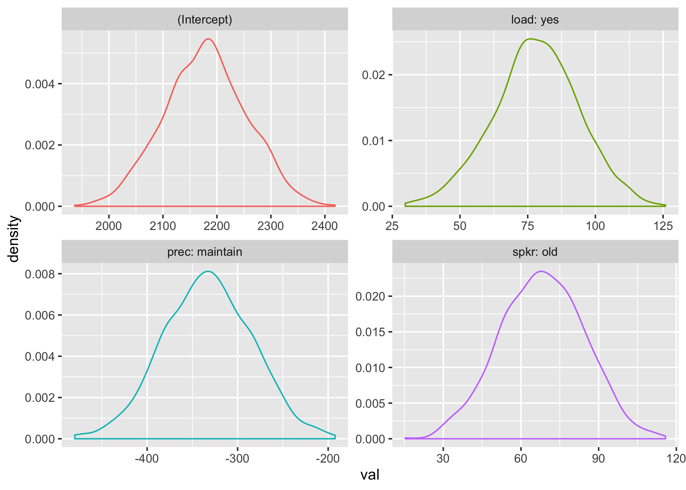
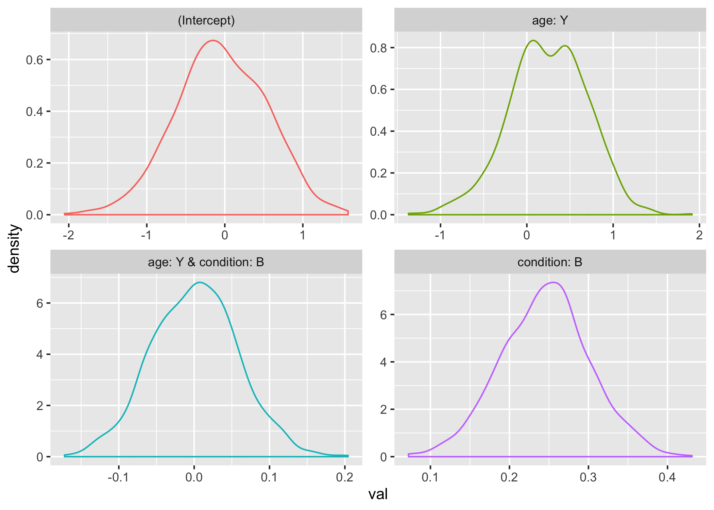

## Setup 

### Julia

Load the packages we'll be using in Julia

~~~~{.julia}
julia> using MixedModels        # run mixed models

julia> using MixedModelsSim     # simulation functions for mixed models

julia> using RCall              # call R functions from inside Julia

julia> using DataFrames, Tables # work with data tables

julia> using Random, Statistics # statistical functions

julia> using CSV                # write CSV files

~~~~~~~~~~~~~


### R

Also load any packages we'll be using in R through `RCall()`.

~~~~{.julia}
R"""
library(ggplot2) # for visualisation
library(dplyr)   # for data wrangling
library(tidyr)   # for data wrangling
""";
~~~~~~~~~~~~~


### Define Custom functions

It's useful to be able to weave your file quickly while you're debugging, 
so set the number of simulations to a relatively low number while you're 
setting up your script and change it to a larger number when everything
is debugged.

~~~~{.julia}
nsims = 1000 # set to a low number for test, high for production
~~~~~~~~~~~~~


~~~~
1000
~~~~


~~~~{.julia}
# hopefully in MixedModelsSim soon

function sim_to_df(sims)
    tab = DataFrame()
    for (i, sim) in enumerate(sims)
        df = DataFrame(sim)
        df[!, :iteration] .= i
        df[!, :var] .= string.(collect(keys(sim)))
        append!(tab, df)
    end
    longtab = stack(tab, 1:(ncol(tab)-2), variable_name = :coefname)
    widetab = unstack(longtab, :var, :value)
    rename!(widetab, ["coefname", "iteration",  "p",  "se",  "z",  "beta" ])
    sort!(widetab, [:iteration])
    select!(widetab, [:iteration, :coefname, :beta, :se, :z, :p])
end

function power_table(sim, alpha = 0.05)
    pvals = DataFrame(columntable(sim).p)
    pvals = stack(pvals) 
    pwr = by(pvals, :variable, :value => x->mean(x.<alpha) )
    rename!(pwr, ["coefname", "power"])
end

function simdat_crossed(subj_n = 1, item_n = 1;
    subj_btwn = nothing, item_btwn = nothing, both_win = nothing)

    # set up subj table
    if isnothing(subj_btwn)
        subj_vals = [nlevels(subj_n, "S")]
        sb_vars = []
    else
        sc = values(subj_btwn) |> collect
        sc = vcat([nlevels(subj_n)], sc)
        subj_prod = Iterators.product(sc...)
        subj_total_n = length(subj_prod)
        subj_vals = columntable(subj_prod) |> collect
        subj_vals[1] = nlevels(subj_total_n, "S")
        sb_vars = collect(keys(subj_btwn))
    end

    subj_names = vcat(["subj"], sb_vars)
    subj = NamedTuple{Tuple(Symbol.(subj_names))}(subj_vals)

    # set up item table
    if isnothing(item_btwn)
        item_vals = [nlevels(item_n, "I")]
        ib_vars = []
    else
        ic = values(item_btwn) |> collect
        ic = vcat([nlevels(item_n, "I")], ic)
        item_prod = Iterators.product(ic...)
        item_total_n = length(item_prod)
        item_vals = columntable(item_prod) |> collect
        item_vals[1] = nlevels(item_total_n, "I")
        ib_vars = collect(keys(item_btwn))
    end

    item_names = vcat(["item"], ib_vars)
    item = NamedTuple{Tuple(Symbol.(item_names))}(item_vals)

    # set up within both table
    if (isnothing(both_win))
        # cross the subject and item tables 
        design = factorproduct(subj, item) |> DataFrame
    else 
        wc = values(both_win) |> collect
        win_prod = Iterators.product(wc...)
        win_vals = columntable(win_prod) |> collect
        win_names = collect(keys(both_win))
        win = NamedTuple{Tuple(Symbol.(win_names))}(win_vals)

        # cross the subject and item tables with any within factors 
        design = factorproduct(subj, item, win) |> DataFrame
    end

    # add random numbers as a DV
    design.dv = randn(nrow(design))

    design

end
~~~~~~~~~~~~~


~~~~
simdat_crossed (generic function with 3 methods)
~~~~


#### Define: ggplot_betas

This function plots the beta values returned from `simulate_waldtests` using ggplot in R.
If you set a figname, it will save the plot to the specified file.

~~~~{.julia}
function ggplot_betas(sim, figname = 0, width = 7, height = 5) 

    beta_df = DataFrame(columntable(sim).β)

    R"""
        p <- $beta_df %>%
            gather(var, val, 1:ncol(.)) %>%
            ggplot(aes(val, color = var)) +
            geom_density(show.legend = FALSE) +
            facet_wrap(~var, scales = "free")

        if (is.character($figname)) {
            ggsave($figname, p, width = $width, height = $height)
        }

        p
    """
end
~~~~~~~~~~~~~


~~~~
ggplot_betas (generic function with 4 methods)
~~~~


## Existing Data

Load existing data from this morning's tutorial. Set the contrasts and run model 4 from the tutorial.

~~~~{.julia}
# load data
kb07 = MixedModels.dataset("kb07");

# set contrasts
contrasts = Dict(:spkr => HelmertCoding(), 
                 :prec => HelmertCoding(), 
                 :load => HelmertCoding());

# define formula
kb07_f = @formula( rt_trunc ~ 1 + spkr+prec+load + (1|subj) + (1+prec|item) );

# fit model
kb07_m = fit(MixedModel, kb07_f, kb07, contrasts=contrasts)
~~~~~~~~~~~~~


~~~~
Linear mixed model fit by maximum likelihood
 rt_trunc ~ 1 + spkr + prec + load + (1 | subj) + (1 + prec | item)
     logLik        -2 logLik          AIC             BIC       
 -1.43319251×10⁴  2.86638501×10⁴  2.86818501×10⁴  2.87312548×10⁴

Variance components:
             Column      Variance   Std.Dev.   Corr.
item     (Intercept)     133015.240 364.71254
         prec: maintain   63766.936 252.52116 -0.70
subj     (Intercept)      88819.437 298.02590
Residual                 462443.388 680.03190
 Number of obs: 1789; levels of grouping factors: 32, 56

  Fixed-effects parameters:
──────────────────────────────────────────────────────
                 Estimate  Std.Error  z value  P(>|z|)
──────────────────────────────────────────────────────
(Intercept)     2181.85      77.4681    28.16   <1e-99
spkr: old         67.879     16.0785     4.22   <1e-4 
prec: maintain  -333.791     47.4472    -7.03   <1e-11
load: yes         78.5904    16.0785     4.89   <1e-5 
──────────────────────────────────────────────────────
~~~~


### Simulate data with same parameters

Use the `simulate_waldtests()` function to run 1000 iterations of data sampled 
using the parameters from `m4`. Set up a random seed to make the simulation reproducible. 
You can use your favourite number.

~~~~{.julia}
# seed for reproducibility
rng = MersenneTwister(8675309);

# run 1000 iterations
kb07_sim = simulate_waldtests(rng, nsims, kb07_m, use_threads = true);
~~~~~~~~~~~~~


Save all data to a csv file.

~~~~{.julia}
kb07_sim_df = sim_to_df(kb07_sim)

CSV.write("sim/kb07_sim.csv", kb07_sim_df)
~~~~~~~~~~~~~


~~~~
"sim/kb07_sim.csv"
~~~~


Plot betas in ggplot.

~~~~{.julia}
ggplot_betas(kb07_sim, "fig/kb07_betas.png");
~~~~~~~~~~~~~





### Power calculation

~~~~{.julia}
power_table(kb07_sim)
~~~~~~~~~~~~~


~~~~
4×2 DataFrame
│ Row │ coefname       │ power   │
│     │ Symbol         │ Float64 │
├─────┼────────────────┼─────────┤
│ 1   │ (Intercept)    │ 1.0     │
│ 2   │ spkr: old      │ 0.991   │
│ 3   │ prec: maintain │ 1.0     │
│ 4   │ load: yes      │ 0.999   │
~~~~


### Change parameters

Let's say we want to check our power to detect effects of spkr, prec, and load 
that are half the size of our pilot data. We can set a new vector of beta values 
with the `β` argument to `simulate_waldtests`.

~~~~{.julia}
newβ = kb07_m.β
newβ[2:4] = kb07_m.β[2:4]/2

kb07_sim_half = simulate_waldtests(rng, nsims, kb07_m, β = newβ, use_threads = true);

power_table(kb07_sim_half)
~~~~~~~~~~~~~


~~~~
4×2 DataFrame
│ Row │ coefname       │ power   │
│     │ Symbol         │ Float64 │
├─────┼────────────────┼─────────┤
│ 1   │ (Intercept)    │ 1.0     │
│ 2   │ spkr: old      │ 0.529   │
│ 3   │ prec: maintain │ 0.928   │
│ 4   │ load: yes      │ 0.692   │
~~~~


# Simulating Data from Scratch


## simdat_crossed

We will set a design where `subj_n` subjects per `age` group (O or Y) respond to `item_n` items in each of two `condition`s (A or B). Create a simulated data structure with `simdat(sub_n, item_n)`.


Running the function with the defaults gives you the general experimental design structure
(i.e., 1 subject and 1 stimulus in each cell).

~~~~{.julia}
# put between-subject factors in a Dict
subj_btwn = Dict("age" => ["O", "Y"])

# put within-subject/item factors in a Dict
both_win = Dict("condition" => ["A", "B"])

# simulate data
dat = simdat_crossed(10, 30, subj_btwn = subj_btwn, both_win = both_win )
~~~~~~~~~~~~~


~~~~
1200×5 DataFrame
│ Row  │ subj   │ age    │ item   │ condition │ dv          │
│      │ String │ String │ String │ String    │ Float64     │
├──────┼────────┼────────┼────────┼───────────┼─────────────┤
│ 1    │ S01    │ O      │ I01    │ A         │ -0.74541    │
│ 2    │ S02    │ O      │ I01    │ A         │ -0.185877   │
│ 3    │ S03    │ O      │ I01    │ A         │ 0.467144    │
│ 4    │ S04    │ O      │ I01    │ A         │ -0.0708465  │
│ 5    │ S05    │ O      │ I01    │ A         │ 0.0503274   │
│ 6    │ S06    │ O      │ I01    │ A         │ 0.156241    │
│ 7    │ S07    │ O      │ I01    │ A         │ 0.108081    │
⋮
│ 1193 │ S13    │ Y      │ I30    │ B         │ -0.00126841 │
│ 1194 │ S14    │ Y      │ I30    │ B         │ 0.308785    │
│ 1195 │ S15    │ Y      │ I30    │ B         │ 1.29083     │
│ 1196 │ S16    │ Y      │ I30    │ B         │ 1.35084     │
│ 1197 │ S17    │ Y      │ I30    │ B         │ 0.0988229   │
│ 1198 │ S18    │ Y      │ I30    │ B         │ 2.04914     │
│ 1199 │ S19    │ Y      │ I30    │ B         │ 0.267711    │
│ 1200 │ S20    │ Y      │ I30    │ B         │ -0.973232   │
~~~~


```

## Set up model

~~~~{.julia}
# set contrasts
contrasts = Dict(:age => HelmertCoding(), 
                 :condition => HelmertCoding());

f1 = @formula dv ~ 1 + age * condition + (1|item) + (1|subj);
m1 = fit(MixedModel, f1, dat, contrasts=contrasts)
~~~~~~~~~~~~~


~~~~
Linear mixed model fit by maximum likelihood
 dv ~ 1 + age + condition + age & condition + (1 | item) + (1 | subj)
   logLik   -2 logLik     AIC        BIC    
 -1713.4070  3426.8140  3440.8140  3476.4446

Variance components:
            Column     Variance    Std.Dev.  
item     (Intercept)  0.0021642529 0.04652153
subj     (Intercept)  0.0000000000 0.00000000
Residual              1.0158815838 1.00790951
 Number of obs: 1200; levels of grouping factors: 30, 20

  Fixed-effects parameters:
───────────────────────────────────────────────────────────────
                          Estimate  Std.Error  z value  P(>|z|)
───────────────────────────────────────────────────────────────
(Intercept)            -0.0213609   0.0303102    -0.70   0.4810
age: Y                  0.00760056  0.0290958     0.26   0.7939
condition: B            0.0668792   0.0290958     2.30   0.0215
age: Y & condition: B  -0.0258042   0.0290958    -0.89   0.3751
───────────────────────────────────────────────────────────────
~~~~


Because the `dv` is just random numbers from N(0,1), there will be basically no subject or item random variance, residual variance will be near 1.0, and the estimates for all effects should be small. Now we can specify fixed and random effects directly in `simulate_waldtests`. 

## Simulate

* Set a seed for reproducibility
* specify new β, σ, and θ

~~~~{.julia}
rng = MersenneTwister(8675309);

new_beta = [0, 0.25, 0.25, 0]
new_sigma = 2.0
new_theta = [1.0, 1.0]

sim1 = simulate_waldtests(rng, nsims, m1, 
                        β = new_beta, 
                        σ = new_sigma, 
                        θ = new_theta,
                        use_threads = true);
~~~~~~~~~~~~~


## Explore simulation output


~~~~{.julia}
ggplot_betas(sim1, "fig/simbetas.png");
~~~~~~~~~~~~~





## Power

~~~~{.julia}
power_table(sim1)
~~~~~~~~~~~~~


~~~~
4×2 DataFrame
│ Row │ coefname              │ power   │
│     │ Symbol                │ Float64 │
├─────┼───────────────────────┼─────────┤
│ 1   │ (Intercept)           │ 0.062   │
│ 2   │ age: Y                │ 0.132   │
│ 3   │ condition: B          │ 0.989   │
│ 4   │ age: Y & condition: B │ 0.056   │
~~~~


## Write a function to vary something

~~~~{.julia}
function mysim(subj_n, item_n, nsims = 1000, 
               beta  = [0, 0, 0, 0],
               sigma = 2.0, 
               theta = [1.0, 1.0],
               seed = convert(Int64, round(rand()*1e8))
               )
    # generate data
    dat = simdat_crossed(subj_n, item_n, subj_btwn = subj_btwn, both_win = both_win )

    # set contrasts
    contrasts = Dict(:age => HelmertCoding(), 
                     :condition => HelmertCoding());

    # set up model
    f = @formula dv ~ 1 + age*condition + (1|item) + (1|subj);
    m = fit(MixedModel, f, dat, contrasts=contrasts)

    # run simulation
    rng = MersenneTwister(seed);

    simulate_waldtests(
        rng, nsims, m, 
        β = beta, 
        σ = sigma, 
        θ = theta, 
        use_threads = true
    );
end
~~~~~~~~~~~~~


~~~~
mysim (generic function with 6 methods)
~~~~


Run simulations over a range of values for any parameter.

~~~~{.julia}
# varying
subj_ns = [20, 30, 40]
item_ns = [10, 20, 30]

# fixed
nsims = 1000
new_beta = [0, 0.4, 0.1, 0]
new_sigma = 2.0
new_theta = [1.0, 1.0]

d = DataFrame()

for subj_n in subj_ns
    for item_n in item_ns
        s = mysim(subj_n, item_n, nsims, new_beta, new_sigma, new_theta);
        pt = power_table(s)
        pt[!, :item_n] .= item_n
        pt[!, :sub_n] .= subj_n
        append!(d, pt)
    end
end

# save the data in long format
CSV.write("sim/power.csv", d)

# spread the table for easier viewing
unstack(d, :coefname, :power)
~~~~~~~~~~~~~


~~~~
9×6 DataFrame. Omitted printing of 1 columns
│ Row │ item_n │ sub_n │ (Intercept) │ age: Y   │ age: Y & condition: B │
│     │ Int64  │ Int64 │ Float64⍰    │ Float64⍰ │ Float64⍰              │
├─────┼────────┼───────┼─────────────┼──────────┼───────────────────────┤
│ 1   │ 10     │ 20    │ 0.087       │ 0.241    │ 0.052                 │
│ 2   │ 10     │ 30    │ 0.076       │ 0.364    │ 0.05                  │
│ 3   │ 10     │ 40    │ 0.092       │ 0.421    │ 0.038                 │
│ 4   │ 20     │ 20    │ 0.065       │ 0.248    │ 0.051                 │
│ 5   │ 20     │ 30    │ 0.057       │ 0.368    │ 0.046                 │
│ 6   │ 20     │ 40    │ 0.066       │ 0.453    │ 0.043                 │
│ 7   │ 30     │ 20    │ 0.061       │ 0.231    │ 0.047                 │
│ 8   │ 30     │ 30    │ 0.065       │ 0.309    │ 0.043                 │
│ 9   │ 30     │ 40    │ 0.061       │ 0.42     │ 0.041                 │
~~~~


## Convert this file 

~~~~{.julia}

# using Weave

# convert to html
# weave("simulation_tutorial.jmd")

# convert to a python notebook
# convert_doc("simulation_tutorial.jmd", "simulation_tutorial.ipynb")

# convert to md for README
# weave("simulation_tutorial.jmd", doctype="pandoc", out.path = "README.md")
~~~~~~~~~~~~~

